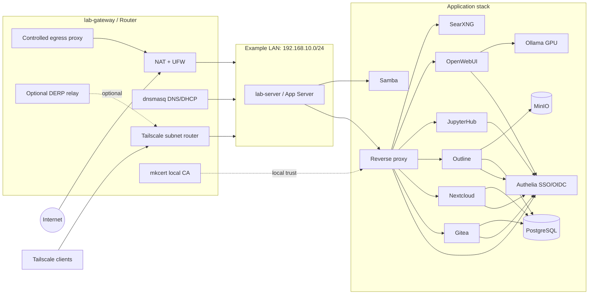

# Research Lab Infrastructure

A self-hosted infrastructure stack for a small research lab, integrating internal authentication, collaborative development, knowledge management, JupyterHub-based computing, local LLM services, storage backends, and secure remote access.

This repository documents a two-host reference deployment:

- `lab-gateway`: gateway, router, firewall, DNS, proxy, certificate, and Tailscale entry point
- `lab-server`: main application server for collaborative services, computing environments, databases, object storage, and LLM workloads

The reference network uses an example `192.168.10.0/24` LAN with Tailscale overlay access for remote clients.

---

## Scope

This repository is a sanitized public version of a real small-lab infrastructure setup.

It is intended to document and reproduce the architecture, service composition, deployment conventions, security model, and operational practices used in an internal research-lab environment.

It is not:

- a turnkey SaaS product
- a Kubernetes distribution
- a fully automated installer for arbitrary environments
- a hardened public-cloud appliance
- a replacement for institutional IT security review

The default deployment model assumes:

- a trusted lab LAN
- Tailscale-based remote access
- selected high-privilege internal services such as JupyterHub
- local configuration rendered from templates
- no real secrets committed to Git

---

## Status

This repository was extracted from a long-running internal lab infrastructure setup and converted into a sanitized public template.

The public repository may not preserve the full private operational history, but the documented stack reflects a deployed and actively maintained research-lab environment.

Maintenance style:

- documentation-first
- Docker Compose based
- security-aware but not fully zero-trust hardened
- optimized for small research groups rather than large enterprise environments

---

## Architecture

```text
Internet ── lab-gateway / Router ── 192.168.10.0/24 LAN ── lab-server / App Server
                │                                               │
                ├─ NAT / UFW firewall                           ├─ Reverse proxy
                ├─ Tailscale subnet router                      ├─ Authelia SSO/OIDC
                ├─ Optional DERP relay                          ├─ Gitea, Nextcloud, Outline
                ├─ Controlled egress proxy                      ├─ JupyterHub, OpenWebUI
                ├─ dnsmasq DNS/DHCP                             ├─ SearXNG
                └─ mkcert local CA                              ├─ Ollama GPU backend
                                                                ├─ PostgreSQL, MinIO
                                                                └─ Optional non-core services
```



---

## Design Principles

- Prefer boring, inspectable components over complex orchestration.
- Use Docker Compose for service-level reproducibility.
- Keep public exposure minimal; prefer LAN and Tailscale access.
- Separate gateway/network responsibilities from application services.
- Centralize authentication where possible through Authelia and OIDC.
- Treat JupyterHub and Docker-socket-based workloads as trusted internal computing services.
- Document manual steps explicitly instead of hiding them in fragile automation.
- Keep secrets out of Git and render local configuration from templates.
- Make the system understandable before making it fully automated.

---

## Service Matrix

| Service | Role | Depends on | Access model |
|---|---|---|---|
| Authelia | SSO/OIDC identity provider | PostgreSQL / Redis if enabled | Internal reverse proxy |
| Gitea | Git hosting and project collaboration | PostgreSQL | Reverse proxy + SSO/OIDC |
| Nextcloud | File sharing and lab documents | PostgreSQL / storage mount | Reverse proxy + SSO/OIDC |
| Outline | Knowledge base / wiki | PostgreSQL / MinIO | Reverse proxy + SSO/OIDC |
| JupyterHub | Multi-user computing environment | Docker socket / host users | Trusted lab mode |
| OpenWebUI | Internal LLM interface | Ollama | Reverse proxy + SSO |
| Ollama | Local LLM inference backend | NVIDIA GPU optional | Internal only |
| SearXNG | Internal metasearch service | service config | Reverse proxy |
| PostgreSQL | Shared relational database backend | storage mount | Internal only |
| MinIO | Object storage backend | storage mount | Internal only |
| Samba | LAN file sharing | host storage | LAN / trusted clients |
| Tailscale | Remote access overlay | gateway host | ACL-controlled overlay |
| dnsmasq | Local DNS/DHCP | gateway host | LAN only |
| mkcert | Local development CA | gateway/server trust store | Internal TLS only |

Optional non-core services should be isolated into separate deployment profiles and are not required for the research-lab stack.

---

## Security Boundaries

| Layer | Boundary |
|---|---|
| Public Internet | No application service is intended to be directly exposed by default |
| Remote access | Tailscale overlay and subnet routing |
| Web access | Reverse proxy in front of selected services |
| Authentication | Authelia SSO/OIDC where supported |
| Data services | PostgreSQL and MinIO remain internal-only |
| High-risk services | JupyterHub and Docker-socket-based workflows are treated as trusted-lab components |
| Secrets | All public files are sanitized; real secrets must be supplied through local `.env` files |
| Local TLS | mkcert is used for internal certificates, not public Web PKI |
| Network assumptions | Reference IP addresses and hostnames are examples, not production secrets |

For detailed notes, see [`SECURITY.md`](SECURITY.md).

---

## High-Risk Components

Some components intentionally trade isolation for usability in a trusted research-lab environment.

### JupyterHub

The JupyterHub deployment may use:

- Docker socket access
- host user directories
- privileged orchestration behavior
- shared compute/storage resources

This mode should be treated as **host-admin equivalent** and must not be exposed directly to the public Internet.

Recommended placement:

```text
Tailscale / LAN → reverse proxy → Authelia/OIDC → JupyterHub
```

### Tailscale Subnet Router

The gateway can expose the lab LAN to remote Tailscale clients. This is powerful but expands the trust boundary.

Recommended controls:

- explicit Tailscale ACLs
- restricted subnet routes
- no unnecessary LAN-wide exposure
- documented device ownership

### Local CA

The mkcert local CA is useful for internal TLS, but its private key can sign trusted local certificates. It must be treated as sensitive material and should not be committed.

---

## Directory Structure

| Directory | Purpose |
|---|---|
| `network/` | Gateway routing, firewall, Tailscale, proxy, DNS, certificates |
| `auth/` | Authelia SSO/OIDC identity provider |
| `services/` | User-facing applications |
| `storage/` | Databases and object storage |
| `llm/` | LLM inference services |
| `dev/` | Development tools and Dockerfiles |
| `infra/` | OS-level setup guides: Docker, LVM/RAID, NVIDIA, SSH |
| `templates/` | Rendered configuration templates and manifest files |
| `scripts/` | Rendering, validation, and maintenance scripts |
| `wiki/` | Centralized deployment and operations documentation |

---

## Prerequisites

The reference deployment assumes:

- two Linux hosts:
  - `lab-gateway`
  - `lab-server`
- Docker Engine and Docker Compose
- a private LAN, for example `192.168.10.0/24`
- Tailscale account for remote access
- local DNS resolution for internal service domains
- optional NVIDIA GPU for Ollama / LLM workloads
- local storage layout for SSD/HDD data volumes
- basic familiarity with:
  - Linux networking
  - Docker Compose
  - reverse proxies
  - DNS
  - systemd services
  - SSH-based administration

---

## Quick Start

Start with the centralized wiki.

1. Read [`wiki/README.md`](wiki/README.md)
2. Copy `.env.example` to `.env`
3. Fill in local values, hostnames, storage paths, and secrets
4. Render local templates:

   ```bash
   ./scripts/render-all.sh
   ```

5. Review generated diffs before committing:

   ```bash
   git diff
   ```

6. Validate Compose configuration:

   ```bash
   ./scripts/check-config.sh
   ```

7. Review storage mount paths for your SSD/HDD layout
8. Deploy services in order:

   ```text
   network → storage → auth → services → llm/dev extras
   ```

---

## Deployment Profiles

The stack is intended to be deployed in stages.

| Profile | Purpose | Typical components |
|---|---|---|
| `network` | Base connectivity and access | NAT, UFW, dnsmasq, Tailscale |
| `storage` | Persistent service backend | PostgreSQL, MinIO, host mounts |
| `auth` | Internal identity layer | Authelia, OIDC clients |
| `core-services` | Collaboration layer | Gitea, Nextcloud, Outline |
| `compute` | Research computing | JupyterHub, notebooks, dev containers |
| `llm` | Local LLM services | Ollama, OpenWebUI |
| `optional` | Non-core services | media, experiments, temporary tools |

See [`wiki/profiles.md`](wiki/profiles.md) for the staged deployment plan.

---

## Validation

Before deploying or committing changes, run:

```bash
cp .env.example .env
./scripts/render-all.sh
./scripts/check-config.sh
```

Recommended manual checks:

```bash
git diff
docker compose config
```

Recommended future checks:

- shellcheck for scripts
- YAML / Compose schema validation
- unresolved placeholder detection
- secret scanning with tools such as `gitleaks`
- CI-based render and validation workflow

---

## Configuration Conventions

- All sensitive values are replaced with placeholders in public files.
- Real secrets belong in local `.env` files or secret stores, not Git.
- Each service uses environment variables or service-level `.env` files.
- Docker Compose is the primary deployment method.
- Services share `global_docker_network` unless a service explicitly requires host networking.
- Rendering templates can modify tracked example files; review diffs before committing.
- Reference IPs and hostnames are examples and should be adapted to the target environment.

---

## Backup and Restore

Backup design is documented in [`wiki/backup.md`](wiki/backup.md).

At minimum, a production-like deployment should define backup procedures for:

- PostgreSQL databases
- MinIO object storage
- Nextcloud data directory
- Gitea repositories and database
- Outline database and object storage
- Authelia configuration
- reverse proxy configuration
- service `.env` files
- local CA material, if used

Backups are not considered valid until restore has been tested.

---

## Documentation

Core documentation:

- [`wiki/README.md`](wiki/README.md) — main deployment guide
- [`wiki/deployment.md`](wiki/deployment.md) — step-by-step deployment path
- [`wiki/env.md`](wiki/env.md) — environment variable reference
- [`wiki/profiles.md`](wiki/profiles.md) — staged deployment profiles
- [`wiki/ports.md`](wiki/ports.md) — host port matrix
- [`wiki/reverse-proxy.md`](wiki/reverse-proxy.md) — reusable Nginx reverse proxy template
- [`wiki/backup.md`](wiki/backup.md) — backup and restore plan
- [`wiki/jupyterhub.md`](wiki/jupyterhub.md) — high-privilege JupyterHub mode and hardening path
- [`templates/render-manifest.tsv`](templates/render-manifest.tsv) — config template rendering manifest
- [`SECURITY.md`](SECURITY.md) — security model and high-risk components

Service-level documentation is placed under each service directory.

---

## Limitations

- The stack is optimized for a trusted small-lab environment, not direct public exposure.
- Some components require manual configuration after initial deployment.
- JupyterHub currently uses a high-privilege trusted-lab mode and should not be exposed directly.
- Hardware-specific paths, GPU configuration, and storage mounts must be adapted before deployment.
- The public repository is sanitized and does not include real secrets, private hostnames, or production data.
- This is not a full infrastructure-as-code system; it intentionally remains inspectable and documentation-heavy.

---

## Roadmap

Planned improvements:

- add CI validation for Docker Compose files and rendered templates
- add secret scanning for public-safe commits
- add complete backup and restore drills
- add hardened deployment profile for JupyterHub
- add monitoring profile for service health and resource usage
- add architecture decision records under `wiki/adr/`
- add Makefile targets for common operations:

  ```bash
  make render
  make validate
  make check-secrets
  make docs
  ```

---

## Intended Use

This repository is primarily useful for:

- small research labs
- bioinformatics or computational biology groups
- students building internal lab infrastructure
- research teams that need Git, documentation, file sharing, notebooks, and local LLM access
- self-hosted environments where institutional infrastructure is insufficient or too slow to adapt

It is best read as an infrastructure reference and deployment notebook rather than a universal installer.

---

## License

This repository is licensed under the MIT License. See [`LICENSE`](LICENSE).
