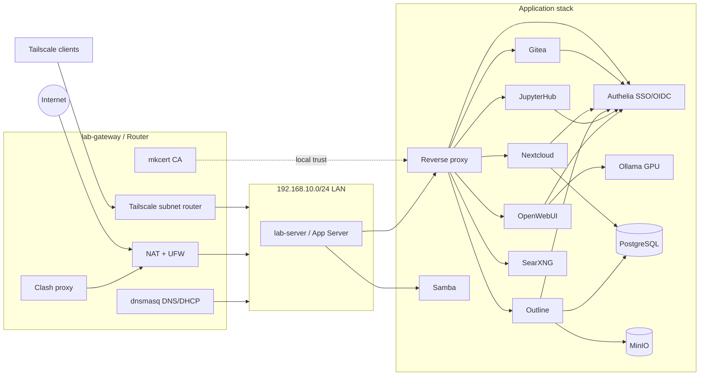

# Homelab Infrastructure

Homelab server infrastructure configuration, organized by service type. Covers two physical machines — a gateway/router and a main application server — connected via a 192.168.10.0/24 LAN with Tailscale overlay for remote access.

## Architecture

```
Internet ── lab-gateway (Router/NAT) ── 192.168.10.0/24 LAN ── lab-server (App Server)
                │                                                   │
                ├─ NAT / ufw firewall                               ├─ Authelia (SSO/OIDC)
                ├─ Tailscale subnet router                          ├─ Gitea, Nextcloud, Outline
                ├─ Clash proxy                                      ├─ JupyterHub, OpenWebUI
                ├─ dnsmasq (local DNS)                              ├─ Ollama (GPU)
                ├─ DERP relay                                       ├─ MinIO, PostgreSQL
                └─ mkcert (self-signed CA)                          └─ Samba, Jellyfin, ...
```



## Directory Structure

| Directory | Purpose |
|-----------|---------|
| `network/` | Gateway routing, Tailscale VPN, proxy, DNS, certificates |
| `auth/` | Authelia SSO/OIDC identity provider |
| `services/` | User-facing applications |
| `storage/` | Databases and object storage |
| `llm/` | LLM inference services |
| `dev/` | Development tools and Dockerfiles |
| `infra/` | OS-level setup guides (Docker, LVM/RAID, NVIDIA, SSH) |

## Quick Start

Start with the centralized wiki:

1. Read `wiki/README.md`
2. Copy `.env.example` to `.env` and fill in your values
3. Render local templates with `scripts/render-all.sh`
4. Review storage mount paths for your SSD/HDD layout
5. Deploy services in order: network → storage → auth → services

## Conventions

- All sensitive values (passwords, keys, tokens) are replaced with placeholders
- Each service uses environment variables or `.env` files for configuration
- Docker Compose is the primary deployment method
- Services share `global_docker_network` unless a service explicitly uses host networking
- Rendering templates can modify tracked example files; review diffs before committing

## Documentation

- `wiki/README.md` — main deployment guide
- `wiki/deployment.md` — step-by-step deployment path
- `wiki/env.md` — environment variable reference
- `wiki/profiles.md` — staged deployment profiles
- `wiki/ports.md` — host port matrix
- `wiki/reverse-proxy.md` — reusable Nginx reverse proxy template
- `wiki/backup.md` — backup and restore plan
- `wiki/jupyterhub.md` — high-privilege JupyterHub mode and hardening path
- `templates/render-manifest.tsv` — config template rendering manifest
- `SECURITY.md` — security model and high-risk components
- Service-level `README.md` files — service-specific notes and manual setup details
